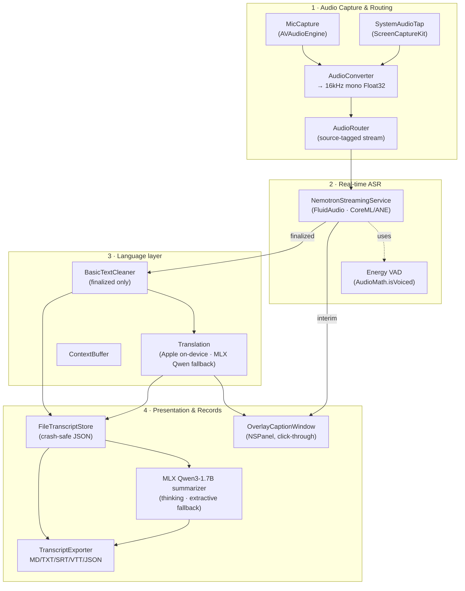
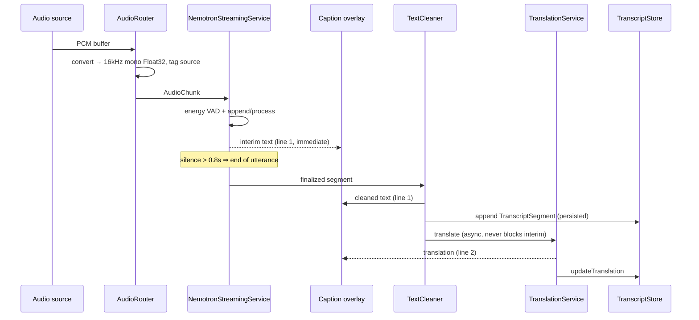

# EdgeAI Flow Translate


[](https://www.buymeacoffee.com/huang422)


**Local, real-time bilingual captions, transcripts & meeting summaries for macOS (Apple Silicon).**

Flow Translate turns the audio of online meetings (Zoom / Teams / Google Meet) and
English videos into a floating, two-line caption overlay — the first line is the
recognized speech, the second line is a live translation — while building a full
bilingual transcript and an end-of-meeting summary. **Everything runs on-device**;
the only network access is a one-time model download.

- **Speech recognition** with NVIDIA **Nemotron‑3.5 Streaming ASR — Multilingual (0.6B)** on the Apple Neural Engine (via [FluidAudio](https://github.com/FluidInference/FluidAudio)). Pick a language or use **Auto** for per-sentence detection / mixed-language audio.
- **Live translation** (default English → Traditional Chinese, also live on the in-progress sentence). A specific source language Apple supports uses Apple's on-device **Translation** framework; **auto-detect** and Apple-unsupported pairs use the on-device **MLX Qwen3-1.7B** model (`/no_think` mode for speed).
- **Two-box floating, click-through caption overlay** — top box = first caption, bottom box = translation (hidden when the second caption is off) — auto-scrolling and staying on top of full-screen meetings/videos without blocking clicks.
- **System audio _and_ microphone**, captured separately and tagged per source. While system audio is playing, mic echo is suppressed so the same speech isn't transcribed twice.
- **Full bilingual transcript**, persisted to disk (crash-safe) and exportable to Markdown / TXT / SRT / VTT / JSON.
- **Post-meeting summary** via an on-demand **MLX Qwen3-1.7B (4-bit)** LLM on the GPU, run in **thinking mode** for quality — overview, key points, decisions, action items, Q&A, glossary, produced in **separate English and Traditional Chinese versions** (with a pure-Swift extractive fallback when offline / on load failure).
- **Global shortcut ⌃⌥C** toggles the overlay from any app (e.g. while Zoom is focused).
- **Private by design** — audio and text never leave your Mac.

> Target hardware: **Apple M1 Pro / 16 GB**, macOS 14+ (Apple Silicon). The
> real-time loop deliberately avoids loading any large LLM so it stays fast and
> memory-light; the heavy summarization model is only loaded on demand, after the
> meeting ends.

---

## Table of contents

- [EdgeAI Flow Translate](#edgeai-flow-translate)
  - [Table of contents](#table-of-contents)
  - [Quick start (end users)](#quick-start-end-users)
  - [Build from source (developers)](#build-from-source-developers)
    - [Run the app on your Mac](#run-the-app-on-your-mac)
    - [The core package](#the-core-package)
  - [System design](#system-design)
    - [High-level architecture](#high-level-architecture)
    - [Real-time data flow](#real-time-data-flow)
    - [Module map](#module-map)
    - [Model runtimes — why ASR uses the ANE and only the summarizer uses MLX](#model-runtimes--why-asr-uses-the-ane-and-only-the-summarizer-uses-mlx)
  - [Settings](#settings)
  - [Performance targets](#performance-targets)
  - [Project layout](#project-layout)
  - [Deployment / release](#deployment--release)
  - [Troubleshooting](#troubleshooting)
  - [Privacy](#privacy)
  - [License](#license)
  - [Contact](#contact)

---

## Quick start (end users)

1. Download `FlowTranslate.dmg` from the [Releases](../../releases) page.
2. Open the DMG and drag **Flow Translate** into **Applications**.
3. Launch it. On first run, grant the prompts:
   - **Microphone** — to caption your own voice.
   - **Screen Recording** — required by macOS to capture *system* audio (the other side of a call, or a video). Toggle it on in **System Settings → Privacy & Security → Screen Recording**, then relaunch.
4. The first time you start a meeting the app downloads its models to disk — the ASR model (~600 MB) and, in parallel, the Qwen model (~1 GB, used by auto/unsupported-language translation and the summary). **Let them finish** (progress is shown); they're cached under `~/Library/Application Support/FlowTranslate/` and later runs work fully offline. Interrupted downloads resume on the next Start — already-downloaded files are skipped (verified by size).
5. Choose an audio source (**System** for meetings/videos, **Mic** for your voice, or both), press **Start**, and toggle **Overlay** to float the captions on screen.

No terminal required.

---

## Build from source (developers)

**Requirements:** macOS 14+ on Apple Silicon, **Xcode 16+**, and [XcodeGen](https://github.com/yonghkim/XcodeGen) (`brew install xcodegen`).

```bash
git clone <this-repo> Flow-Translate
cd Flow-Translate
make bootstrap          # generates FlowTranslate.xcodeproj and opens it
```

Then in Xcode select the **FlowTranslate** scheme and press **Run** (⌘R).

The Xcode project is **generated** from [`project.yml`](project.yml) — it is not
checked in. Re-run `make project` (or `xcodegen generate`) after adding files.

### Run the app on your Mac

> **You need the full Xcode**, not just the Command Line Tools — the app target
> (FluidAudio, MLX, ScreenCaptureKit, the Translation framework) can only be built
> by `xcodebuild`. Check with `xcode-select -p`: if it prints
> `/Library/Developer/CommandLineTools`, install Xcode from the App Store, then:
>
> ```bash
> sudo xcode-select -s /Applications/Xcode.app
> ```

**One command — build and launch** (no terminal juggling):

```bash
make run        # regenerates the project, builds Debug, opens FlowTranslate.app
```

Or do it inside Xcode: `make bootstrap` once, then press **⌘R**.

**After you change code — redeploy & relaunch:**

| What changed | Command |
|--------------|---------|
| Edited existing Swift files | `make run` &nbsp;(or just ⌘R in Xcode) |
| Added / removed / renamed files | `make run` &nbsp;(it runs `xcodegen` first, so new files are picked up) |
| Edited `project.yml` / dependencies | `make project` then `make run` |

`make run` is idempotent: rebuild and relaunch as many times as you like. To force
a clean rebuild: `make clean && make run`.

**Install it like a normal app** (build a signed-as-adhoc `.app` into `/Applications`):

```bash
make dmg                                   # produces Packaging/build/FlowTranslate.dmg
open Packaging/build/FlowTranslate.dmg     # then drag Flow Translate → Applications
```

On first launch macOS will ask for **Microphone** and **Screen Recording**
permission, and the first meeting downloads the ASR model (cached afterwards).

### The core package

Business logic lives in a dependency-free Swift package, **`FlowTranslateCore`**
(Foundation only — no FluidAudio / AppKit). You can build and test it without
opening Xcode:

```bash
make build              # swift build (FlowTranslateCore)
make test               # runs the unit tests (works under CLT or full Xcode)
```

> `make test` wraps `swift test` and, when only the Command Line Tools are
> installed, wires up the `swift-testing` framework search paths automatically.

---

## System design

### High-level architecture

Four layers, loosely coupled through Swift protocols (see `Contracts/Protocols.swift`).
The diagram below reflects the **current implementation**:

```text
┌──────────────────────────────────────────────────────────────────────────┐
│  LAYER 1 . AUDIO CAPTURE & ROUTING                                       │
├──────────────────────────────────────────────────────────────────────────┤
│    MicCapture (AVAudioEngine) ------+                                    │
│                                     +--> AudioConverter --> AudioRouter  │
│    SystemAudioTap (ScreenCaptureKit)-+   16kHz mono F32    source-tagged │
└──────────────────────────────────────────────────────────────────────────┘
                                      |
                                      v  AudioChunk { samples, source, timestamp }
┌──────────────────────────────────────────────────────────────────────────┐
│  LAYER 2 . REAL-TIME ASR      (runs on the Apple Neural Engine)          │
├──────────────────────────────────────────────────────────────────────────┤
│    NemotronStreamingService  --  FluidAudio . CoreML / ANE               │
│    energy VAD (AudioMath.isVoiced) --> utterance segmentation            │
│    interim text -------------------------------> overlay line 1 (now)    │
└──────────────────────────────────────────────────────────────────────────┘
                                      |
                                      v  finalized ASRSegment
┌──────────────────────────────────────────────────────────────────────────┐
│  LAYER 3 . LANGUAGE   (finalized only -- never blocks interim)           │
├──────────────────────────────────────────────────────────────────────────┤
│    BasicTextCleaner  -->  Translation (Apple on-device  /  MLX Qwen)     │
│                           + ContextBuffer (prior sentences)              │
└──────────────────────────────────────────────────────────────────────────┘
                                      |
                                      v  EN (line 1) + ZH (line 2)
┌──────────────────────────────────────────────────────────────────────────┐
│  LAYER 4 . PRESENTATION & RECORDS                                        │
├──────────────────────────────────────────────────────────────────────────┤
│    OverlayCaptionWindow (NSPanel, click-through, always-on-top)          │
│    FileTranscriptStore (crash-safe JSON)  -->  TranscriptExporter        │
│    Summary: MLX Qwen3-1.7B-4bit (on-demand on GPU, thinking, then freed) │
│        fallback --> ExtractiveSummarizer (pure Swift, offline)           │
└──────────────────────────────────────────────────────────────────────────┘
```

The same graph rendered by Mermaid (GitHub view):



### Real-time data flow

Lifecycle of one audio buffer, from the moment someone speaks:



**Why it stays real-time:** interim captions render straight from the ASR partial
callback. Cleanup and translation run **only on finalized sentences** and never
sit in the interim path, so display latency is bounded by the ASR tier, not by
translation.

### Module map

| Layer | Type | Responsibility |
|-------|------|----------------|
| `AudioCapture/` | App | Capture mic + system audio, resample, route with source tags |
| `ASR/` | App | FluidAudio Nemotron streaming wrapper + energy VAD |
| `Translation/` | App | Queue finalized text → Apple on-device translation, or MLX Qwen for auto / unsupported pairs |
| `UI/` | App | Control panel, settings, click-through `NSPanel` overlay |
| `Support/` | App | Permissions, settings persistence |
| `FlowTranslateCore` | Package | Models, protocols, transcript store, exporter, summarizer, text utils — pure & unit-tested |

### Model runtimes — why ASR uses the ANE and only the summarizer uses MLX

Flow Translate deliberately uses a **hybrid runtime**, picking the best accelerator
per task rather than putting everything on MLX:

| Task | Model | Runtime / accelerator | Rationale |
|------|-------|-----------------------|-----------|
| Real-time ASR | Nemotron‑3.5 Streaming 0.6B | **CoreML on the ANE** (FluidAudio) | Always-on streaming wants low **power** + low **memory** and must **leave the GPU free** for the meeting app and (later) the summarizer. The ANE delivers that. |
| Translation (supported pair) | Apple Translation | System framework (on-device) | Zero model management, no extra memory. |
| Translation (auto / unsupported) | **Qwen3-1.7B (4-bit)** | **MLX on the GPU**, `/no_think` | Apple needs a known source; auto-detect and unsupported pairs use the small Qwen model so the second caption still works in real time. |
| Meeting summary | **Qwen3-1.7B (4-bit)** | **MLX on the GPU**, thinking mode, loaded on demand, freed after | A one-shot, non-real-time batch job — exactly where MLX/GPU throughput (and reasoning) pays off. |

> **Is the `mlx-community` Nemotron faster?** That model is the *same* NVIDIA
> weights in MLX format. Published MLX numbers (≈112× realtime) are **batch**
> benchmarks on an M4 Max / 64 GB; they don't transfer to an M1 Pro / 16 GB, and
> caption latency is bounded by the streaming chunk **tier** (560/1120 ms),
> not by raw throughput. For an always-on, on-battery, GPU-shared workload the
> ANE path is the better-optimized choice — so the ASR stays on CoreML/ANE while
> MLX is reserved for the summarizer, where it actually helps.

The MLX summarizer (`FlowTranslate/Summarization/MLXMeetingSummarizer.swift`) loads
`mlx-community/Qwen3-1.7B-4bit` only when you end a meeting, runs a **map-reduce**
over the transcript (final step in **thinking mode**), parses the model's
structured JSON into a `Summary`, then releases the model. If it can't run (offline
/ first-run download failed / low memory) it transparently falls back to the
pure-Swift extractive summarizer.

---

## Settings

Open the **gear icon** in the top-right. Preferences are persisted automatically.

- **First caption (recognition) language** — any of Nemotron's 32 supported locales, or **Auto** (per-sentence detection / mixed-language). Default `en-US`.
- **Latency tier (advanced)** — `560ms` (most real-time, default) / `1120ms` (more accurate).
- **Second caption** — turn translation on/off; target **Traditional Chinese** or **English**. A status line shows the active source → target and whether it's using Apple or the Qwen model (with live load progress).
- **Presentation** — font size (12–22), click-through overlay. The overlay is **two fixed boxes** (top = first caption, bottom = translation; the bottom box hides when the second caption is off), auto-scrolling so the newest line stays visible, and can be toggled anywhere with **⌃⌥C**.

Defaults match the primary use case: **English → Traditional Chinese**, most real-time.

---

## Performance targets

| Metric | Target |
|--------|--------|
| Interim English caption latency | < 1.5 s |
| Translation after finalize | < 1 s |
| ASR runtime | ANE-accelerated, RTFx ≫ 1× on M1 Pro |
| Overlay | 60 fps, no stutter |
| Memory | Real-time loop stays light; summarization LLM loaded on demand then released |

---

## Project layout

```text
Flow-Translate/
├── Package.swift                 # FlowTranslateCore Swift package
├── project.yml                   # XcodeGen spec for the app target
├── Makefile                      # bootstrap / build / test / dmg
├── Sources/FlowTranslateCore/    # pure logic (no platform deps)
│   ├── Models/                   # Session, TranscriptSegment, Summary, CaptionSettings, …
│   ├── Contracts/Protocols.swift # layer interfaces
│   ├── Audio/AudioMath.swift     # rms / energy VAD
│   ├── Translation/              # ContextBuffer, BasicTextCleaner, BasicS2TWPConverter
│   ├── Transcript/               # In-memory + file (crash-safe) stores, exporter
│   └── Summarization/            # ExtractiveSummarizer (pure-Swift fallback)
├── FlowTranslate/                # macOS app (SwiftUI + AppKit)
│   ├── AudioCapture/  ASR/  Translation/  UI/  Support/
│   ├── Summarization/            # MLXMeetingSummarizer (MLX Qwen3-1.7B)
│   ├── Info.plist  FlowTranslate.entitlements
├── Scripts/                      # bootstrap.sh, run-tests.sh
├── Packaging/                    # build_dmg.sh, notarize.sh
└── .github/workflows/            # ci.yml, release.yml
```

---

## Deployment / release

```text
┌──────────────────────────────────────────────────────────────────────────┐
│  Developer  ->  git tag vX.Y.Z  &&  git push --tags                      │
└──────────────────────────────────────────────────────────────────────────┘
                                      |
                                      v
┌──────────────────────────────────────────────────────────────────────────┐
│  GitHub Actions: release.yml   (macos-15 runner, Xcode 16)               │
└──────────────────────────────────────────────────────────────────────────┘
                                      |
                                      v
┌──────────────────────────────────────────────────────────────────────────┐
│  xcodegen generate  ->  xcodebuild Release  ->  FlowTranslate.app        │
└──────────────────────────────────────────────────────────────────────────┘
                                      |
                                      v
┌──────────────────────────────────────────────────────────────────────────┐
│  Packaging/build_dmg.sh   ->   FlowTranslate.dmg                         │
└──────────────────────────────────────────────────────────────────────────┘
                                      |
                                      v  (optional: notarize.sh if signing secrets present)
┌──────────────────────────────────────────────────────────────────────────┐
│  softprops/action-gh-release  ->  GitHub Release asset                   │
└──────────────────────────────────────────────────────────────────────────┘
                                      |
                                      v
┌──────────────────────────────────────────────────────────────────────────┐
│  User: download .dmg  ->  drag to /Applications  ->  launch              │
└──────────────────────────────────────────────────────────────────────────┘
```

Releases are produced by [`.github/workflows/release.yml`](.github/workflows/release.yml)
when you push a `v*` tag, or locally:

```bash
make dmg                          # builds Release .app → FlowTranslate.dmg
```

To notarize for distribution outside the App Store (optional), set
`DEVELOPER_ID_APP` and a `NOTARY_PROFILE`, then:

```bash
bash Packaging/notarize.sh
```

The release workflow uploads the DMG to a GitHub Release; if signing secrets
(`DEVELOPER_ID_APP`, `NOTARY_PROFILE`) are configured it also notarizes.

---

## Troubleshooting

| Symptom | Fix |
|---------|-----|
| No system audio captions | Grant **Screen Recording** in System Settings → Privacy & Security, then relaunch. |
| No microphone captions | Grant **Microphone** permission. |
| First start sits on "Loading model…" | First run downloads the ~600 MB ASR model — wait for the progress to finish (needs network once). If interrupted, the app detects the partial download and re-fetches it automatically. |
| Translation line empty | Apple pairs download a one-time language pack on first use. For **auto-detect** / Apple-unsupported pairs the status line shows the Qwen model loading — the second caption appears once it's ready. |
| Captions look garbled in noise | Energy VAD filters silence; heavy background music still reduces ASR quality. |
| Overlay blocks clicks | Click-through is on by default; check the **Click-through** toggle in Settings. |

---

## Privacy

All audio capture, recognition, translation, transcript storage and summarization
happen **locally**. The only outbound network use is the **one-time** download of
model weights / language packs; afterwards the app works fully offline. Transcripts
are stored under `~/Library/Application Support/FlowTranslate/`.

---

## License

Released under the [MIT License](LICENSE). Third-party components keep their own
licenses — notably **FluidAudio** (Apache-2.0) and the **Nemotron ASR** model
weights (see NVIDIA's model card for terms).

## Contact

- Developer: Tom Huang
- Email: huang1473690@gmail.com
