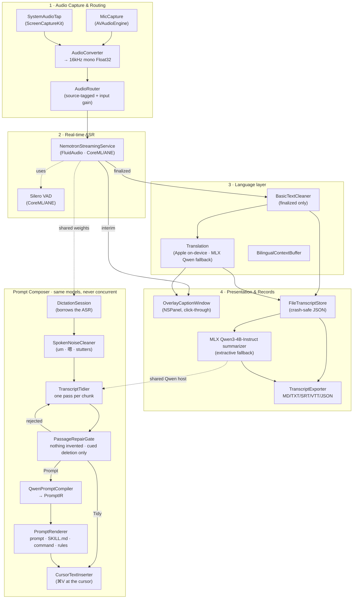
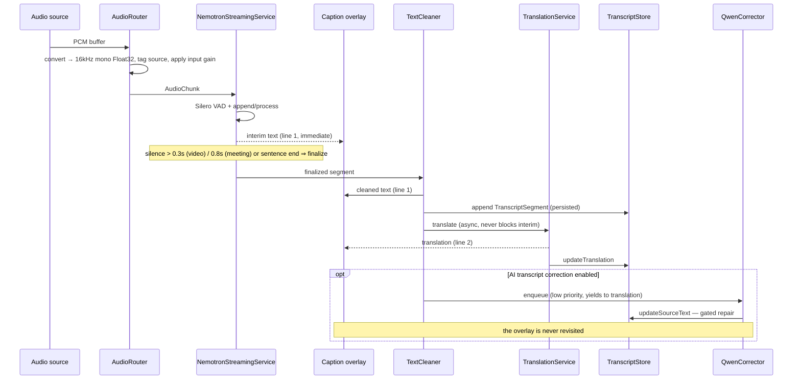

# EdgeAI Flow Translate


[](../../releases/latest/download/FlowTranslate.dmg)
[](https://www.buymeacoffee.com/huang422)


**Local, real-time bilingual captions, transcripts & meeting summaries for macOS (Apple Silicon).**

> **⬇️ [Download the latest FlowTranslate.dmg](../../releases/latest/download/FlowTranslate.dmg)** — macOS on Apple Silicon. Open the DMG and drag **Flow Translate** to **Applications**.

Flow Translate turns the audio of online meetings (Zoom / Teams / Google Meet) and
English videos into a floating, two-line caption overlay — the first line is the
recognized speech, the second line is a live translation — while building a full
bilingual transcript and an end-of-meeting summary. **Everything runs on-device**;
the only network access is a one-time model download.

- **Speech recognition** — NVIDIA **Nemotron‑3.5 Streaming ASR Multilingual (0.6B)** on the Apple Neural Engine via [FluidAudio](https://github.com/FluidInference/FluidAudio). 32 locales, or **Auto** for mixed-language audio.
- **Live translation** — default English → Traditional Chinese, live on the in-progress sentence too. Engine: **Apple** (on-device Translation framework, Qwen fallback) or **Qwen** (MLX Qwen3-4B-Instruct-2507 with bilingual rolling context). The Qwen path is tuned for real time: a bounded queue keeps the newest sentences fresh, common phrases translate instantly from a lookup table, and a guard fixes Simplified-character leakage.
- **Speaker diarization** (on by default) — Core ML `pyannote/speaker-diarization-3.1` + WeSpeaker, labelling mic and system audio independently. Names appear in captions, transcripts, summaries and exports.
- **Floating, click-through overlay** — stacked caption units, original above translation. **Nothing moves or changes appearance when a sentence finalizes**: one weight, full brightness, the live line marked only by a breathing dot, caret and underline, and the speaker name in a fixed-width slot. The box is pinned by its bottom edge with a fixed width — the sentence being spoken always starts on the same line, and only the top edge moves, following the top of the oldest caption as sentences finalize. **⌃⌥P** pins it so the captions stop updating while you read. Stays above full-screen meetings and passes clicks through.
- **System audio *and* microphone**, captured separately and tagged per source, with mic echo suppressed while system audio plays.
- **Adjustable input gain / auto-gain** — lift a quiet speaker *before* recognition so they clear the voice-activity gate, with a soft limiter so boosted peaks never clip.
- **Full bilingual transcript**, persisted crash-safe and exportable to Markdown / TXT / SRT / VTT / JSON.
- **Optional AI transcript correction** (off by default) — a second, non-real-time quality track. Repairs land in the transcript, summary and exports; the overlay is never rewritten and captions never wait.
- **Post-meeting summary** — on-demand MLX **Qwen3-4B-Instruct-2507 (4-bit)**: overview, key points, decisions, action items, Q&A and glossary, in separate English and Traditional Chinese versions (pure-Swift extractive fallback offline).
- **Two dictation recognizers** — on macOS 26 the built-in `DictationTranscriber` is the default (punctuation arrives already applied, assets managed by the system); anywhere else, and whenever you pick it, the bundled Nemotron model. Captions always use Nemotron, because speaker diarization runs inside that pipeline and the built-in recognizer has no equivalent. Both feed the identical Qwen tidy pass. Both are fully offline once their language assets are installed.
- **Dictate anywhere with ⌃⌥Space** — speak into any app and the text lands at the cursor. **Tidy** (default) is your own sentences with mis-hearings, typos and punctuation fixed and self-corrections merged — *"訂在週二兩點，啊不對，改成週三十點"* arrives as Wednesday only; **Raw** is verbatim; **Prompt** is the full compiled agent brief. One model pass over the whole passage, guarded by a gate that permits deletion only where you corrected yourself.
- **Prompt Composer** (separate tab) — describe a coding task by voice or typing, in Chinese or English, and get a prompt written for a coding agent in **Claude's XML form or Codex's Markdown form**. A question stays a question and can sit beside a task; several requests in one breath become a numbered list; eleven deterministic compression techniques and a sourced 52-rule symbol library shorten the rest. Install it as a `SKILL.md`, a slash command, or synced rules for both `.claude/rules/` and `AGENTS.md`. See [Prompt Composer](#prompt-composer).
- **Private by design** — audio and text never leave your Mac.

> Target hardware: **Apple M1 Pro / 16 GB**, macOS 15+. The real-time loop keeps
> only the ASR on the ANE, and the default setup never loads a large LLM at all —
> Apple's Translation framework handles the second caption and the ~2.3 GB Qwen
> model stays on disk until you ask for the summary. Three opt-in choices bring it
> into memory for the meeting: the **Qwen** translation engine, **Auto**
> first-caption detection, and **AI transcript correction**. Each says so in
> Settings.

---

## Table of contents

- [EdgeAI Flow Translate](#edgeai-flow-translate)
  - [Table of contents](#table-of-contents)
  - [Quick start (end users)](#quick-start-end-users)
  - [Build from source (developers)](#build-from-source-developers)
    - [Run the app on your Mac](#run-the-app-on-your-mac)
    - [The core package](#the-core-package)
  - [System design](#system-design)
    - [High-level architecture](#high-level-architecture)
    - [Real-time data flow](#real-time-data-flow)
    - [Module map](#module-map)
    - [Model runtimes — why ASR uses the ANE and only the summarizer uses MLX](#model-runtimes--why-asr-uses-the-ane-and-only-the-summarizer-uses-mlx)
  - [Prompt Composer](#prompt-composer)
    - [The pipeline](#the-pipeline)
    - [⌃⌥Space — dictate anywhere](#space--dictate-anywhere)
    - [Output format — pick your agent](#output-format--pick-your-agent)
    - [What the numbers mean](#what-the-numbers-mean)
    - [Compression — eleven techniques](#compression--eleven-techniques)
    - [The rulebook — a Prompt RFC](#the-rulebook--a-prompt-rfc)
    - [Where the rules go — Claude *and* Codex](#where-the-rules-go--claude-and-codex)
    - [Prompt linting](#prompt-linting)
    - [Sharing models with captions](#sharing-models-with-captions)
  - [Settings](#settings)
  - [Performance targets](#performance-targets)
  - [Project layout](#project-layout)
  - [Deployment / release](#deployment--release)
    - [Ship a change — step-by-step commands](#ship-a-change--step-by-step-commands)
  - [Troubleshooting](#troubleshooting)
  - [Privacy](#privacy)
  - [Contributing](#contributing)
  - [License](#license)
  - [Contact](#contact)

---

## Quick start (end users)

1. Download `FlowTranslate.dmg` from the [Releases](../../releases) page.
2. Open the DMG and drag **Flow Translate** into **Applications**.
3. Launch it. On first run, grant the prompts:
   - **Microphone** — to caption your own voice.
   - **Screen Recording** — required by macOS to capture *system* audio (the other side of a call, or a video). Toggle it on in **System Settings → Privacy & Security → Screen Recording**, then relaunch.
   - **Accessibility** — only for ⌃⌥Space dictation, so the result can be typed straight at your cursor. Captions never touch it; without it a dictation lands on the clipboard instead.

   **The app never opens System Settings by itself.** When a permission is what blocks something, it says so and puts an **開啟設定 Open Settings** button beside the message — going there is your call. Every pane also has a row under **Settings → Prompt → 權限 Permissions**.
4. On first launch FlowTranslate checks for its models and, if any are missing, offers to **download them up front** — the ASR model (~600 MB), the Silero VAD model (~1 MB, neural speech endpointing) and the Qwen model (~2.3 GB, for auto/unsupported-language translation and the summary). **Let them finish** (progress is shown); the ASR + VAD models cache under `~/Library/Application Support/FluidAudio/` and Qwen under `~/Library/Application Support/FlowTranslate/`, so later runs work fully offline. Interrupted downloads resume — already-fetched files are skipped (verified by size).
5. Choose an audio source (**System** for meetings/videos, **Mic** for your voice, or both), press **Start**, and toggle **Overlay** to float the captions on screen. To remove everything later, open **Settings → Maintenance → Uninstall** — it also clears the app's Microphone, Screen Recording and Accessibility privacy entries, so a future reinstall prompts cleanly.

No terminal required.

---

## Build from source (developers)

**Requirements:** macOS 15+ on Apple Silicon, **Xcode 16+**, and [XcodeGen](https://github.com/yonaskolb/XcodeGen) (`brew install xcodegen`).

```bash
git clone <this-repo> Flow-Translate
cd Flow-Translate
make bootstrap          # generates FlowTranslate.xcodeproj and opens it
```

Then in Xcode select the **FlowTranslate** scheme and press **Run** (⌘R).

The Xcode project is **generated** from [`project.yml`](project.yml) — it is not
checked in. Re-run `make project` (or `xcodegen generate`) after adding files.

### Run the app on your Mac

> **You need the full Xcode**, not just the Command Line Tools — the app target
> (FluidAudio, MLX, ScreenCaptureKit, the Translation framework) can only be built
> by `xcodebuild`. Check with `xcode-select -p`: if it prints
> `/Library/Developer/CommandLineTools`, install Xcode from the App Store, then:
>
> ```bash
> sudo xcode-select -s /Applications/Xcode.app
> ```

**One command — build and launch** (no terminal juggling):

```bash
make run        # regenerates the project, builds Debug, opens FlowTranslate.app
```

Or do it inside Xcode: `make bootstrap` once, then press **⌘R**.

**After you change code — redeploy & relaunch:**

| What changed | Command |
|--------------|---------|
| Edited existing Swift files | `make run` &nbsp;(or just ⌘R in Xcode) |
| Added / removed / renamed files | `make run` &nbsp;(it runs `xcodegen` first, so new files are picked up) |
| Edited `project.yml` / dependencies | `make project` then `make run` |

`make run` is idempotent: rebuild and relaunch as many times as you like. To force
a clean rebuild: `make clean && make run`.

**Install it like a normal app** (build a signed-as-adhoc `.app` into `/Applications`):

```bash
make dmg                                   # produces Packaging/build/FlowTranslate.dmg
open Packaging/build/FlowTranslate.dmg     # then drag Flow Translate → Applications
```

On first launch macOS will ask for **Microphone** and **Screen Recording**
permission (plus **Accessibility** the first time you use ⌃⌥Space dictation), and
FlowTranslate offers to download its models once (cached afterwards). A local
build is signed ad-hoc, so macOS treats each rebuild as a different app and the
grants have to be given again — see **Settings → Maintenance → Reset permissions**.

### The core package

Business logic lives in a dependency-free Swift package, **`FlowTranslateCore`**
(Foundation only — no FluidAudio / AppKit). You can build and test it without
opening Xcode:

```bash
make build              # swift build (FlowTranslateCore)
make test               # runs the unit tests (works under CLT or full Xcode)
```

> `make test` wraps `swift test` and, when only the Command Line Tools are
> installed, wires up the `swift-testing` framework search paths automatically.

---

## System design

### High-level architecture

Four layers, loosely coupled through Swift protocols (see `Contracts/Protocols.swift`).
The diagram below reflects the **current implementation**:

```text
┌──────────────────────────────────────────────────────────────────────────┐
│  LAYER 1 . AUDIO CAPTURE & ROUTING                                       │
├──────────────────────────────────────────────────────────────────────────┤
│    MicCapture (AVAudioEngine) ------+                                    │
│                                     +--> AudioConverter --> AudioRouter  │
│    SystemAudioTap (ScreenCaptureKit)-+   16kHz mono F32    source-tagged │
└──────────────────────────────────────────────────────────────────────────┘
                                      |
                                      v  AudioChunk { samples, source, timestamp }
┌──────────────────────────────────────────────────────────────────────────┐
│  LAYER 2 . REAL-TIME ASR      (runs on the Apple Neural Engine)          │
├──────────────────────────────────────────────────────────────────────────┤
│    NemotronStreamingService  --  FluidAudio . CoreML / ANE               │
│    Silero VAD (CoreML / ANE) --> utterance segmentation                  │
│    interim text -------------------------------> overlay line 1 (now)    │
└──────────────────────────────────────────────────────────────────────────┘
                                      |
                                      v  finalized ASRSegment
┌──────────────────────────────────────────────────────────────────────────┐
│  LAYER 3 . LANGUAGE   (finalized only -- never blocks interim)           │
├──────────────────────────────────────────────────────────────────────────┤
│    BasicTextCleaner  -->  Translation (Apple on-device  /  MLX Qwen)     │
│                           + BilingualContextBuffer (prior pairs)         │
└──────────────────────────────────────────────────────────────────────────┘
                                      |
                                      v  EN (line 1) + ZH (line 2)
┌──────────────────────────────────────────────────────────────────────────┐
│  LAYER 4 . PRESENTATION & RECORDS                                        │
├──────────────────────────────────────────────────────────────────────────┤
│    OverlayCaptionWindow (NSPanel, click-through, always-on-top)          │
│    FileTranscriptStore (crash-safe JSON)  -->  TranscriptExporter        │
│    Summary: MLX Qwen3-4B-Instruct-2507 (on-demand GPU, then freed)       │
│        fallback --> ExtractiveSummarizer (pure Swift, offline)           │
└──────────────────────────────────────────────────────────────────────────┘

   The Prompt Composer is a SECOND CONSUMER of the same two models. It never
   runs at the same time as a meeting — mutual exclusion, not a priority queue.

┌──────────────────────────────────────────────────────────────────────────┐
│  PROMPT COMPOSER      (same ASR + same Qwen host, never concurrently)    │
├──────────────────────────────────────────────────────────────────────────┤
│  ⌃⌥Space / tab -> DictationSession (borrows the ASR) -> raw transcript   │
│         |                                                                │
│         v  SpokenNoiseCleaner (deterministic: um / 嗯 / stutters)        │
│  TranscriptTidier                                                        │
│    PassageChunker  -> one pass per chunk, NOT one call per sentence      │
│    PromptTextRepairer.repairPassage (Qwen, whole passage)                │
│    PassageRepairGate  -- nothing invented; deletion only where cued      │
│         |                     `-- rejected? fall back to per-sentence    │
│         +-----------------------> RAW / TIDIED --> CursorTextInserter    │
│         v  (compiled prompt only)                                        │
│  QwenPromptCompiler --> PromptIR {question, goal, steps, constraints…}   │
│    PromptOptimizer (lint + auto-fix + ground <files> in the request)     │
│    SymbolCompressor (52-rule library) + LexicalCompressor (11 techniques)│
│    PromptRenderer --> clipboard prompt | SKILL.md | slash command | rules│
└──────────────────────────────────────────────────────────────────────────┘
```

The same graph rendered by Mermaid (GitHub view):


```mermaid
flowchart TB
    subgraph Capture["1 · Audio Capture & Routing"]
        MIC["MicCapture<br/>(AVAudioEngine)"]
        SYS["SystemAudioTap<br/>(ScreenCaptureKit)"]
        CONV["AudioConverter<br/>→ 16kHz mono Float32"]
        ROUTER["AudioRouter<br/>(source-tagged + input gain)"]
        MIC --> CONV
        SYS --> CONV
        CONV --> ROUTER
    end

    subgraph ASR["2 · Real-time ASR"]
        NEMO["NemotronStreamingService<br/>(FluidAudio · CoreML/ANE)"]
        VAD["Silero VAD<br/>(CoreML/ANE)"]
        ROUTER --> NEMO
        NEMO -. uses .-> VAD
    end

    subgraph Lang["3 · Language layer"]
        CLEAN["BasicTextCleaner<br/>(finalized only)"]
        TRANS["Translation<br/>(Apple on-device · MLX Qwen fallback)"]
        CTX["BilingualContextBuffer"]
    end

    subgraph UX["4 · Presentation & Records"]
        OVERLAY["OverlayCaptionWindow<br/>(NSPanel, click-through)"]
        STORE["FileTranscriptStore<br/>(crash-safe JSON)"]
        SUM["MLX Qwen3-4B-Instruct summarizer<br/>(extractive fallback)"]
        EXPORT["TranscriptExporter<br/>MD/TXT/SRT/VTT/JSON"]
    end

    subgraph Prompt["Prompt Composer · same models, never concurrent"]
        DICT["DictationSession<br/>(borrows the ASR)"]
        CLEANP["SpokenNoiseCleaner<br/>(um · 嗯 · stutters)"]
        TIDY["TranscriptTidier<br/>one pass per chunk"]
        GATE["PassageRepairGate<br/>nothing invented · cued deletion only"]
        COMPILE["QwenPromptCompiler<br/>→ PromptIR"]
        REND["PromptRenderer<br/>prompt · SKILL.md · command · rules"]
        CURSOR["CursorTextInserter<br/>(⌘V at the cursor)"]
        DICT --> CLEANP --> TIDY --> GATE
        GATE -- "rejected" --> TIDY
        GATE -- "Tidy" --> CURSOR
        GATE -- "Prompt" --> COMPILE --> REND --> CURSOR
    end

    NEMO -- "interim" --> OVERLAY
    NEMO -- "finalized" --> CLEAN
    CLEAN --> TRANS
    CLEAN --> STORE
    TRANS --> OVERLAY
    TRANS --> STORE
    STORE --> SUM
    STORE --> EXPORT
    SUM --> EXPORT

    NEMO -. "shared weights" .-> DICT
    SUM -. "shared Qwen host" .-> TIDY
```

### Real-time data flow

Lifecycle of one audio buffer, from the moment someone speaks:


```mermaid
sequenceDiagram
    participant A as Audio source
    participant R as AudioRouter
    participant S as NemotronStreamingService
    participant O as Caption overlay
    participant C as TextCleaner
    participant T as TranslationService
    participant D as TranscriptStore
    participant G as QwenCorrector

    A->>R: PCM buffer
    R->>R: convert → 16kHz mono Float32, tag source, apply input gain
    R->>S: AudioChunk
    S->>S: Silero VAD + append/process
    S-->>O: interim text (line 1, immediate)
    Note over S: silence > 0.3s (video) / 0.8s (meeting) or sentence end ⇒ finalize
    S->>C: finalized segment
    C->>O: cleaned text (line 1)
    C->>D: append TranscriptSegment (persisted)
    C->>T: translate (async, never blocks interim)
    T-->>O: translation (line 2)
    T->>D: updateTranslation
    opt AI transcript correction enabled
        C->>G: enqueue (low priority, yields to translation)
        G->>D: updateSourceText — gated repair
        Note over O,G: the overlay is never revisited
    end
```

**Why it stays real-time:** interim captions render straight from the ASR partial
callback. Cleanup and translation run **only on finalized sentences** and never
sit in the interim path, so display latency is bounded by the ASR tier, not by
translation.

**Two quality tracks.** Everything above the `opt` block is the *fast track*: it
must keep up with speech, so its text is whatever the recognizer produced and is
never rewritten once shown. Optional correction is the *accurate track*: it lags
by design, only runs while the model is otherwise idle, and lands solely in the
stored transcript (and therefore the summary and exports). Splitting them is what
lets the record improve without the captions jittering.

### Module map

| Layer | Type | Responsibility |
|-------|------|----------------|
| `AudioCapture/` | App | Capture mic + system audio, resample, per-source input gain (AGC + limiter), route with source tags |
| `ASR/` | App | FluidAudio Nemotron streaming wrapper + Silero VAD endpointing |
| `Translation/` | App | Queue finalized text → Apple translation or the shared MLX Qwen (`QwenModelHost`) for auto / unsupported pairs; `QwenCorrector` repairs the recorded transcript on a separate low-priority queue |
| `Prompt/` | App | Prompt Composer: dictation session, the single Qwen extraction call, artifact writer, cursor insertion |
| `UI/` | App | Control panel, settings, click-through `NSPanel` overlay, Prompt tab |
| `Support/` | App | Permissions, settings persistence, global hotkeys, MLX memory governance |
| `FlowTranslateCore` | Package | Models, protocols, transcript store, exporter, summarizer, text utils — pure & unit-tested |

### Model runtimes — why ASR uses the ANE and only the summarizer uses MLX

Flow Translate deliberately uses a **hybrid runtime**, picking the best accelerator
per task rather than putting everything on MLX:

| Task | Model | Runtime / accelerator | Rationale |
|------|-------|-----------------------|-----------|
| Real-time ASR | Nemotron‑3.5 Streaming 0.6B | **CoreML on the ANE** (FluidAudio) | Always-on streaming wants low **power** + low **memory** and must **leave the GPU free** for the meeting app and (later) the summarizer. The ANE delivers that. |
| Translation (system engine, supported pair) | Apple Translation | System framework (on-device) | Zero model management, no extra memory. |
| Translation (auto / unsupported / Qwen engine) | **Qwen3-4B-Instruct-2507 (4-bit)** | **MLX on the GPU**, non-thinking | Apple needs a known source; auto-detect, unsupported pairs and the user-selected Qwen engine use the on-device model. Real-time is protected by a bounded queue (drop-oldest), an instant-phrase lookup table, and input-scaled decode caps; zh-Hant output gets a script/terminology guard (ICU `Hans-Hant` + Taiwan terms). |
| Meeting summary | **Qwen3-4B-Instruct-2507 (4-bit)** | **MLX on the GPU**, non-thinking, loaded on demand, freed after | A one-shot, non-real-time batch job — exactly where MLX/GPU throughput pays off. |

> **Is the `mlx-community` Nemotron faster?** It is the *same* NVIDIA weights in
> MLX format. The published numbers (≈112× realtime) are **batch** benchmarks on
> an M4 Max / 64 GB, and caption latency is bounded by the streaming chunk
> **tier** (560/1120/2240 ms), not by raw throughput. For an always-on,
> on-battery, GPU-shared workload the ANE path is the better choice.

> **On the latency tiers:** each is a separately converted Core ML package, not a
> runtime switch — the encoder's tensor shapes are baked in at conversion, so only
> ~7% of a tier's bytes (the decoder/joint side) are byte-identical between tiers.
> All tiers share `att_context_size [42, 13]` (3.36 s of left context), so they
> differ in chunk size, not in how much history the model sees. FluidAudio
> converted some tiers from a newer checkpoint than others, which is visible in
> each variant's `metadata.json`.

The summarizer (`MLXMeetingSummarizer.swift`) runs only when you end a meeting:
a **map-reduce** over the transcript, structured JSON parsed into a `Summary`,
then the model is released. Offline or on load failure it falls back to the
pure-Swift extractive summarizer.

**One shared Qwen, bounded GPU cache.** Live translation, transcript correction,
the summary and every prompt path run through a single `QwenModelHost`, so the
4-bit model is loaded **at most once**. MLX's Metal buffer cache is bounded at
launch and cleared at lifecycle boundaries (`Support/MLXMemory.swift`), so freed
weights and KV-caches go back to the OS instead of leaving the app sitting at many
GB after a meeting.

---

## Prompt Composer

A second tab and a global hotkey that turn what you say into text a coding agent
can act on. It reuses the models the captions already load, so it costs no extra
resident memory.

Two things come out of it, and most dictation wants the first:

**Tidy — your own sentences, spelled correctly.** For a message, a commit
body, a note. Mis-hearings, typos, punctuation and sentence boundaries fixed;
self-corrections merged, so *"把會議訂在週二下午兩點，啊不對，改成週三早上十點"*
arrives as Wednesday only. Nothing added, nothing restructured.

**A compiled prompt — a brief for Claude Code or Codex.** Structured into the tags
each vendor documents, constraints collapsed into a sourced symbol library, and
installable into your project as a skill, a slash command or a rules file.

### The pipeline

```
speech (⌃⌥Space or the tab) — or typing
   → SpokenNoiseCleaner     strip hesitation sounds (speech only, deterministic)
   → PassageChunker         split only if it will not fit one pass (~700 tokens)
   → PromptTextRepairer     ONE model pass over the whole passage, per chunk
        .repairPassage        fixes mis-hearings, punctuation, self-corrections
   → PassageRepairGate      nothing invented; deletion only where you cued it
        rejected? ──────────→ per-sentence repair for that chunk alone
   ├─ TIDY / RAW ────────→ CursorTextInserter (⌘V at the cursor)
   └─ COMPILED PROMPT
      → QwenPromptCompiler  ← the ONLY intent-extraction call: request → strict JSON
      → PromptIR            the prompt AST {question, goal, steps, constraints, …}
      → PromptOptimizer     de-hedge, de-duplicate, ground <files>, lint + auto-fix
      → LexicalCompressor   eleven deterministic compression techniques
      → SymbolCompressor    constraints → rulebook symbols (52, each sourced)
      → PromptRenderer      prompt · SKILL.md · slash command · rules
```

Only the two model stages need a model, and each does one job — asking a single
4B pass to fix mis-hearings *and* restructure *and* emit strict JSON is what
produced poor output. Everything else is pure Swift in `FlowTranslateCore`:
unit-tested, instant, no GPU time. Only filler removal is voice-specific (a typed
"嗯" is deliberate); typo repair and re-segmentation run for typed input too.

### ⌃⌥Space — dictate anywhere

Press once to start, once to finish, **⎋ or the panel's ✕ to throw it away**. A
HUD by the pointer shows real progress (token counts, not a spinner) and the
result is typed into whatever field has focus. **Three things it can insert**,
switchable from the panel itself:

| Mode | Contract | Model |
|---|---|---|
| `Raw` | Exactly what was heard. No edits at all. | none |
| **`Tidy`** (default) | What you meant to say: mis-hearings, typos, punctuation, sentence boundaries, self-corrections merged. Adds nothing. | one pass |
| `Prompt` | A brief for a coding agent: Tidy, then compiled into tags. | one pass + compile |

`Tidy` is the default because a global hotkey fires in every application, and
most are not a coding agent: pressing it in Slack and getting `<task>` tags is a
surprise. `Raw` is verbatim on purpose — it is the mode that answers "what did the
recognizer actually hear?", which is the question you ask when Tidy gets a term
wrong.

**Tidy is one generation over the whole transcript**, not one per sentence. The
per-sentence shape came from the caption pipeline, where streaming matters;
nothing is displayed here until the pass finishes, so it bought nothing and cost
three things: it fed each call the preceding *repaired* sentences as context —
the setup [arXiv 2409.09785](https://www.arxiv.org/pdf/2409.09785v3) measured
raising word error rate through error propagation; it made self-correction
structurally impossible, since "訂在週二兩點，啊不對，改成週三十點" spans a
sentence boundary by definition; and it re-prefilled the ~650-token system prompt
once per sentence.

Self-correction merging is what [Wispr Flow](https://wisprflow.ai/) and
[Typeless](https://www.typeless.com/) both lead with, and it is the one case where
a tidy pass may delete something you said — so **deletion has to be earned**.
`SelfCorrectionCues` counts the words people say when they change their mind
("actually", "no wait", "不對", "我是說"); a passage containing none licenses no
deletion at all, and each cue buys about one clause.

`PassageRepairGate` inverts the per-sentence rules. There, everything in the input
had to survive; here the binding rule is that **nothing may appear that was not
dictated** — no invented numbers, identifiers or lines — while disappearance is
allowed up to what the cues licensed. It also catches what a per-sentence gate
never had to: a repetition loop (ten times the tokens, and the repetition
penalty's 20-token window cannot see a long-period one) and truncation at the
token cap, detected from the token counter rather than the text. On any rejection
the failing **chunk alone** falls back to the per-sentence loop.

One thing it does not buy: **speed**. Decode is the floor and the output is as
long as the input, so only the repeated prefill goes away.

### Output format — pick your agent

**Claude** — XML tags, per Anthropic's guidance that they "help Claude parse
complex prompts unambiguously":

```
<task>Add exponential-backoff retry to the uploader</task>

<context>Sources/Uploader.swift fails on transient 5xx</context>

<constraints>NO_DEPS</constraints>
```

**Codex / AGENTS.md** — Markdown headings following OpenAI's four building blocks
(goal, context, format, constraints):

```
## Goal
Add exponential-backoff retry to the uploader

## Context
Sources/Uploader.swift fails on transient 5xx

## Constraints
- No new third-party dependencies
```

The choice also selects each rule's wording: Claude gets the fuller phrasing and
the positive form where one exists, Codex the short declarative its guidance asks
for. A positive form must say everything the prohibition said and is refused if it
does not — it *replaces* the prohibition rather than leading it, so one that reads
better and says less would delete the rule. Both polarity and named identifiers
are checked: `NO_DEPS` as "Solve it with what the project already depends on" left
a prompt that forbade nothing, and `KEEP_API` rendered without the letters `API`.

### What the numbers mean

The saving shown is **this prompt with symbols against the same prompt written
out** — not against what you dictated. A compiled prompt is *supposed* to be
longer than the sentence it came from: it states the scope boundary and the
acceptance criterion the sentence left implicit.

Counts come from the Qwen model's own BPE tokenizer when it is loaded, and from a
character heuristic otherwise; the readout says which. Neither is a Claude token
count — Anthropic publishes no tokenizer, `tiktoken` undercounts Claude by 15–20%,
and the tokenizer introduced with Opus 4.7 produces ~30% more tokens than earlier
models for the same text.

### Compression — eleven techniques

Deterministic and training-free, modelled on
[`less-tokens`](https://github.com/shaminchokshi/less-tokens) (MIT). Part-of-speech
tagging, lemmatization and NER come from Apple's `NaturalLanguage`, so there is no
dependency and nothing leaves the machine.

Filler phrases · abbreviations · contractions · filler words · stopwords ·
function words · POS keep-only · lemmatization · synonyms · protected named
entities · normalization.

Two are shaped by measurement rather than intuition. *An Empirical Study on Prompt
Compression* ([arXiv 2505.00019](https://arxiv.org/abs/2505.00019)) found that
removing `the` costs almost nothing while removing **`a` hurts accuracy** — so
`a`/`an` are never pruned — and that LLMLingua-2's pruning does *not* track
grammatical category, so POS keep-only stays implemented, tested, and switched off
in every shipped profile.

**Compression level is per section, not per prompt.** Background prose can lose
half its words and still say the same thing; a constraint cannot lose one, and a
path is returned byte-for-byte.

| Profile | English | Chinese |
|---|---|---|
| conservative | −4% | −5% |
| **balanced** (default) | **−21%** | −5% |
| aggressive | −23% | −5% |

Chinese sits at −5% whatever you pick: `NLTagger` returns `OtherWord` for every
Chinese token and offers no lemma, so those stages are skipped rather than
guessed at. It costs nothing in practice — the compiled prompt is English by
default, and the same constraint costs about three times more tokens in Chinese
(Latin prose averages 4.3 characters per token, CJK 1.25, a digit run exactly one
token per digit; Settings ▸ Prompt re-runs the probe that measured this).

**Never removed, at any profile:** negations, question words, named entities, code
identifiers, paths, flags, versions, numbers and rule symbols. "Do not run this"
becoming "Do run this" is the worst thing a compressor can do, so it is tested at
every profile rather than assumed.

### The rulebook — a Prompt RFC

Recurring constraints collapse to symbols (`NO_DEPS`, `KEEP_API`, `TEST_PASS`),
defined once in the project; from the second prompt on, a 14-token constraint
costs three. Nothing published maps a stable identifier to a constraint, so each
rule is specified the way an RFC specifies a standard:

```yaml
id: KEEP_API
category: architecture
aliases: [API_STABLE, NO_BREAKING_CHANGE]   # alternate identifiers
match:                                       # phrasings the matcher recognises
  - keep the public interface
  - 不要動 API
description: Do not change any public API signature or behaviour.
backends:
  claude: Keep backward compatibility. Never change public interfaces.
  codex:  Maintain existing public APIs.
source: Semantic Versioning 2.0.0 §8
```

`aliases` and `match` are separate on purpose: one is for humans referencing the
rule by another name, the other lets "不要加套件" and "no new libraries" resolve to
the same symbol. The matcher also carries a **negation guard** — token overlap
alone would rate "add new dependencies" as a near-perfect match for `NO_DEPS`.

**Every rule cites a source, and a test enforces it.** The stdlib ships 52 rules
across eight categories — coding, testing, architecture, security, git,
performance, **workflow** and **code review** — from Anthropic's prompting
guidance, Sentry's `prompt-optimizer`, OWASP, Semantic Versioning, Conventional
Commits and Ousterhout.

*Workflow* covers how the agent should work rather than what it should build; the
category exists because the study of 253 real `CLAUDE.md` files
([arXiv 2509.14744](https://arxiv.org/abs/2509.14744)) found Development Process
in 37.2% of them. *Code review* is separate because its failure mode is the
opposite of testing's — a weak suite misses defects, a weak review **invents**
them (GPT-4: 88.2% recall against 22.6% precision; curl closed its bug bounty
after AI reports drove the confirmed rate below 5%). Its central rule,
`REPORT_ALL_THEN_FILTER`, has three independent sources agreeing on it and reads
backwards, which is exactly why it is marked counter-intuitive.

**Counter-intuitive rules compress — with their reason.** Compact Constraint
Encoding ([arXiv 2604.07192](https://arxiv.org/abs/2604.07192); 6 rounds, 11
models, 830+ invocations) measured symbol against sentence at Cliff's δ < 0.01:
encoding makes no difference to compliance, but counter-intuitive constraints are
satisfied as rarely as 10% of the time where conventional ones reach 99%+. So
exempting eleven rules from compression bought nothing measurable and cost four
times the tokens — which is why "上網搜尋" never came back as a symbol however
often it was asked for. They now render as `WEB_SEARCH — <reason>`: the symbol
carries the instruction, the rationale rides inline, and stating *why* is the part
Anthropic's guidance says moves compliance.

### Where the rules go — Claude *and* Codex

The two ecosystems do not read each other's files, so the rulebook is written to
both:

| File | Read by | Loaded |
|---|---|---|
| `.claude/rules/flow-translate-symbols.md` | Claude Code | Every session start |
| `AGENTS.md` (managed block) | Codex, Cursor, Copilot, Aider, Zed… | Per that tool |
| `CLAUDE.md` containing `@AGENTS.md` | Claude Code | Bridge, created only if absent |

`AGENTS.md` usually already holds your own instructions, so the rules go inside a
managed block and **everything outside it is returned byte-for-byte** — read,
merge, write, verified idempotent by test. The `.claude/rules/` file is owned by
this app; your `CLAUDE.md` is never rewritten.

**Three ways to write a constraint**, measured on one two-constraint prompt:

| Mode | Tokens | Needs a synced project |
|---|---|---|
| Keep my wording | 39 | no |
| Symbols + legend | 81 | no |
| **Symbols only** (default) | **28** | **yes** |

There was a fourth, "rulebook wording", between the first two. It rendered the
same bytes as "keep my wording" for every prompt the app could show — any mode but
the first puts the rulebook in the compiler's system prompt, so constraints come
back as symbols, and from there both modes must expand them to the same text.
Switching the picker changed nothing on screen. "Keep my wording" also suppresses
the symbol catalogue at compile time, so your sentence stays yours.

"Symbols only" writes the constraints out when the project has no rulebook, rather
than emitting an identifier the agent cannot resolve — cheaper than the legend
that fallback used to add. Syncing switches the mode on for you, since making bare
symbols honest is the only thing syncing is for.

**How much to print.** `輸出詳細度 Detail` has two levels, and the line between
them is one question: **did the request say it, or did this tool produce it?**
`精簡 Compact` is the default.

| Section | Tokens | Where the content comes from | Compact |
|---|---|---|---|
| `question` / `task` (+ numbered steps) | 42 | the request | ✓ |
| `out_of_scope` | 25 | the request — or one line from the linter | ✓ stated only |
| `context` | 24 | the request | ✓ |
| `files` | 18 | the request, **verified** | ✓ |
| `constraints` | 15 | the request | ✓ |
| `done_when` | 12 | the request | ✓ |
| `output` | 11 | the request | ✓ |
| `risks` | 10 | the model, inferred | — |
| `tools` | 7 | the model, inferred | — |

Measured on a real compiled prompt, which is what decided the split — an earlier
three-level version was built on intuition and got it backwards. The gate on
`out_of_scope` is on its **content**, not on the section: a boundary you stated
out loud ("不要動到 public API") prints at both levels, and only the linter's own
boilerplate line — written when the request named no boundary at all — is dropped
in Compact. `files` stays in Compact not for importance but **verifiability**:
every path in it has been checked against the request text. The picker prints the
tag names it will emit, so the choice is checkable rather than a word to be
trusted.

### Prompt linting

Wording that measurably degrades recent models is **fixed during compile** — each
has one correct resolution, so you get a finished prompt rather than a to-do list.
Only contradictory constraints are surfaced for a decision, because nothing but
the author knows which was meant.

| Rule | Why |
|---|---|
| `CRITICAL:` / `YOU MUST` / 一定要 | Claude 4.6+ follows instructions closely; emphasis overtriggers |
| "double-check your answer" | Self-verification is built in; asking causes over-checking |
| "think step by step" | Wasted tokens on a model with adaptive thinking |
| Missing scope exclusions | Recent models widen scope unless boundaries are explicit |
| Persona without behaviour | "You are a senior engineer" costs tokens and changes nothing |
| Contradictory constraints | The model picks one arbitrarily — the user must decide |
| Unverifiable acceptance | "high quality" cannot be checked |

Two more checks run on the compiled IR rather than on wording.

**Files must have been named.** `<files>` is the largest saving a coding prompt
has, but only if the paths are real — and a 4B model given worked examples copies
from them, so requests naming no file came back citing `Sources/Uploader.swift`,
a path out of the compiler's own Example 1. Any reference whose name is absent
from the request is dropped. Matching allows the last component alone, because
dictation loses separators ("sources uploader dot swift").

**A question stays a question — and can sit beside a task.** Compiling a question
as work produces a prompt telling Claude to go and build something: not a weaker
answer but the opposite of the one asked for, and it reads as a perfectly good
prompt, so nothing catches it. `question` and `goal` are **separate fields**,
because a request is routinely both:

```xml
<question>
1. 為何第二字幕會跳動？
2. finalize 有 bug 嗎？
</question>

<task>
修好 finalize 造成第二字幕跳動的問題

1. 找出 finalize 的問題
2. 修好它
</task>

<answer_first>Answer the question before starting the work. If the answer changes
what should be done, say so rather than proceeding with the task as written.</answer_first>
```

Several questions in one breath stay several, numbered, so a missed one is
visible; a premise sentence stays attached to the question it sets up. Detection
is deterministic (punctuation, then interrogatives, then advice-seeking phrasing)
because a 4B model shown four task-shaped examples reaches for `goal` — and it
runs **per sentence**, so "為何字幕會跳動？順便把 finalize 修好" keeps its
instruction instead of relabelling the whole request as a question. With no work
attached, `<answer_first>` becomes Anthropic's own [sample prompt for conservative
action](https://platform.claude.com/docs/en/build-with-claude/prompt-engineering/claude-prompting-best-practices),
which would contradict a `<task>` tag if emitted beside one.

**Several tasks stay several tasks**, as a numbered list under the goal — the
guide asks for sequential steps "when the order or completeness of steps matters",
and a numbered list is the one shape where a missing item is visible.

**One pass, never two.** A request over the decode budget used to be thrown away
and rebuilt from raw text; now the truncated JSON is cut back to its last complete
field and closed, so only the bullet in flight is lost. Splitting a long request
into two compiles is worse than a generous cap — the second half compiles without
the first half's context.

### Sharing models with captions

The composer uses the same `NemotronStreamingService` and `QwenModelHost` as the
meeting — no second copy of either model. Safety is **hard mutual exclusion**:
recording and compiling are blocked while a meeting, summary or bulk download owns
the models, and the tab and the hotkey exclude each other. Starting any of those
cancels *and awaits* in-flight prompt work first, because unloading the Qwen
container mid-generation is a real crash.

Typing is never blocked — the constraint is the GPU, not the keyboard — so a
request can be drafted during a meeting and compiled after. The model is released
90 seconds after prompt work goes idle.

Mutual exclusion rather than a priority queue is deliberate: on Apple silicon the
ANE and GPU share one memory bus, so a 4B decode beside live captions shows up as
caption latency jitter.

## Settings

Open the **gear icon** in the top-right. Preferences are persisted automatically.

- **Scenario** — what the *system audio* is: **🎬 Video** (edited content; sentences finalize after a 0.3 s pause) or **👥 Meeting** (live speakers; tolerates 0.8 s thinking pauses so sentences aren't cut in half). The microphone is always a live human, so it always uses meeting timing. Values follow streaming-caption practice (Azure ~0.5 s, AssemblyAI 0.7 s, Deepgram ≥1 s) and pause research: read speech pauses 0.15–0.5 s at boundaries, spontaneous speech hesitates 0.5–1.5 s mid-sentence. Applies on the next **Start**.
- **First caption (recognition) language** — any of Nemotron's 32 locales, or **Auto**. Default `en-US`. **Naming the language is an accuracy setting, not just a lock:** a Latin-script locale loads a vocabulary-pruned build (2,828 tokens instead of 13,087), so there are far fewer confusable words; Auto always loads the full multilingual one. Mandarin has one entry (`zh-CN`) because the model has one — no shipped variant's tokenizer contains a `zh-TW` tag — and the Traditional output is produced afterwards by the script guard, on the live line as well as the finalized one.
- **口述引擎 Dictation engine** — `自動`(default) / `Mac 內建` / `Nemotron`. Automatic resolves to the built-in recognizer on macOS 26 and to Nemotron below it; a value stored on a newer Mac degrades safely on an older one, and the row says so on a Mac that cannot run it. The dictation language is **中文 / 英文** on both engines, plus **混說** on Nemotron only — the built-in `DictationTranscriber` takes exactly one locale for a whole session and has no multi-language form, so the option is not offered where it cannot be honoured. (It used to be, and resolved silently to the Mac's *interface* language, which is the single biggest reason this engine could recognize worse than the system's own dictation.) The transcriber is configured from Apple's own `progressiveLongDictation` preset rather than by hand, and it is fed 16 kHz mono — the rate it asks for, so nothing is resampled and no band is lost. **The built-in recognizer downloads nothing from this app**: the framework ships with macOS and its per-language assets are the system's, fetched once on first use and shared with system dictation, so a language already set up in *System Settings → Keyboard → Dictation* costs nothing. ⌃⌥Space finishes a running dictation, and abandons one that has not produced words yet (while a model is still downloading or loading); ⎋ cancels at any stage, including mid-compile, and the panel's **✕** does the same. Neither needs a permission: ⎋ is claimed as a global hot key for the length of the session (so it works from any application on any display, and is given back the moment the panel closes), and ✕ is a button on a window that is already on screen.
- **Latency tier (advanced)** — `560ms` (default) / `1120ms` / `2240ms`. **Not an accuracy setting.** FluidAudio measures 2.28% / 2.28% / 2.46% WER across the three and states that "WER is neutral across tiers (within n=100 noise)"; what changes is chunk latency and throughput (42.1× / 65.0× / 93.6× RTFx). 560ms puts words on screen while the speaker is still talking; 2240ms is FluidAudio's own default and costs the least CPU. Dictation always uses `1120ms` — it holds the best measured WER jointly with 560ms at 1.5× the throughput, and its encoder is quicker to compile onto the ANE on first load, which is the wait you actually feel before the first word is recognized.
- **AI transcript correction** — off by default. Finalized sentences are repaired by the shared Qwen model **in the transcript only**, on a queue behind live translation; the overlay is never rewritten. Every repair passes a safety gate (script preservation, length ratio, digit preservation, edit distance). Keeps the ~2.3 GB model resident for the meeting.
- **Speaker diarization** — **on by default.** Core ML `pyannote/speaker-diarization-3.1` + WeSpeaker, run independently on each source, splitting text at measured speaker changes rather than ASR chunk boundaries. Costs ~60 MB and one inference per finalized sentence.

  Speakers are named `Claude Mango`, not `Speaker 1` — a model name and a fruit, drawn without replacement so no two share either half. The band shows the model half alone (its speaker column is reserved on every row); the full name goes to transcript, summary and export. Past ten speakers the pools are exhausted and numbering resumes (`Speaker 11`).

  **Sensitivity** exists because the two failure modes need opposite corrections. Two people on one mic sit far apart in embedding space and *over*-segment; five on a conference call are compressed through one channel and *under*-segment. `偏合併` for the first, `偏分離` for the second, `標準` on FluidAudio's documented 0.65.
- **Carry acoustic context (experimental)** — off. The encoder's 3.36 s of history is normally cleared per sentence. Keeping it may sharpen opening words but skips the language-lock re-seed and can run one sentence into the next. No WER harness here, so it ships as a switch to compare on your own speech.
- **Second caption** — on/off; target **Traditional Chinese** or **English**; engine **Apple** (fastest) or **Qwen** (context-aware; forced when the first caption is **Auto**).
- **Overlay presentation** — font size (12–22), background opacity, primary line, visible lines (1–3), interim style, click-through, auto-close on stop. *Visible lines* sets how many finalized captions are kept. Inside the box there are two areas: the sentence being spoken has its own **reserved** area at the foot, so its first row always starts on the same line and it grows downward into space already set aside for it; the finalized lines sit above it at their own height, so the top edge of the box lands on the top of the oldest caption with no reserved blank above it. **Only the top edge ever moves, and only when a sentence finalizes** — the left, right and bottom edges are fixed, and nothing resizes while anybody is talking. Captions wrap rather than being shrunk — up to two rows each with one for the translation — and your caption size is never adjusted to make text fit. The live area reserves those rows whether or not the sentence uses them, which is what keeps the bottom edge and the translation row still while somebody is speaking; a short caption shows the reserved row as blank space, and that is the price of an overlay that does not move. All lines render at the same brightness; the live one is marked by its dot, caret and underline. **⌃⌥C** toggle · **⌃⌥P** pin · **⌃⌥=** / **⌃⌥-** font size.
- **Audio input** — fixed **input gain** per source (0–30 dB) plus **Auto-gain** (rate-limited, noise-gated, boost-only) with a soft limiter. Off by default.

Defaults match the primary use case: first caption **`en-US`** at the **560 ms** (most real-time) tier, second caption **on**, targeting **Traditional Chinese**, with **speaker diarization on**.

---

## Performance targets

| Metric | Target |
|--------|--------|
| Interim English caption latency | < 1.5 s |
| Translation after finalize | < 1 s |
| ASR runtime | ANE-accelerated, RTFx ≫ 1× on M1 Pro |
| Overlay | 60 fps, no stutter |
| Memory | Real-time loop stays light: mic + system audio run independent streaming pipelines over **one shared copy** of the ASR weights (~633 MB, not two), and one shared Qwen (loaded on demand, freed after) + bounded MLX cache so memory returns near idle after a meeting |

---

## Project layout

```text
Flow-Translate/
├── Package.swift                 # FlowTranslateCore Swift package
├── project.yml                   # XcodeGen spec for the app target
├── Makefile                      # bootstrap / build / test / dmg
├── Sources/FlowTranslateCore/    # pure logic (no platform deps)
│   ├── Models/                   # Session, TranscriptSegment, Summary, CaptionSettings, …
│   ├── Contracts/Protocols.swift # layer interfaces
│   ├── Audio/                    # AudioMath (rms/level), Endpointer (Silero-driven utterance
│   │                             #   boundaries), SemanticEndpoint, GainProcessor
│   ├── Captions/                 # CaptionBandState, PrefixStableText, InterimSourceArbiter
│   ├── Translation/              # BilingualContextBuffer, BasicTextCleaner, BasicS2TWPConverter,
│   │                             #   TraditionalChineseGuard, InstantPhraseTranslations,
│   │                             #   TranscriptCorrectionGate, SpokenTextMetrics
│   ├── Transcript/               # In-memory + file (crash-safe) stores, exporter
│   └── Summarization/            # ExtractiveSummarizer (pure-Swift fallback)
├── FlowTranslate/                # macOS app (SwiftUI + AppKit)
│   ├── AudioCapture/  ASR/  Translation/  UI/  Support/
│   ├── Summarization/            # MLXMeetingSummarizer (MLX Qwen3-4B-Instruct)
│   ├── Info.plist  FlowTranslate.entitlements
├── Scripts/                      # bootstrap.sh, run-tests.sh
├── Packaging/                    # build_dmg.sh, notarize.sh
└── .github/workflows/            # ci.yml, cla.yml, release-please.yml
```

---

## Deployment / release

```text
┌──────────────────────────────────────────────────────────────────────────┐
│  Developer  ->  Conventional-Commit pushes to main (feat: / fix: …)      │
└──────────────────────────────────────────────────────────────────────────┘
                                      |
                                      v
┌──────────────────────────────────────────────────────────────────────────┐
│  release-please  ->  opens/updates a "release PR" (bumps version + log)  │
└──────────────────────────────────────────────────────────────────────────┘
                                      |   merge the release PR  =  publish
                                      v
┌──────────────────────────────────────────────────────────────────────────┐
│  release-please  ->  tag vX.Y.Z  +  GitHub Release                       │
└──────────────────────────────────────────────────────────────────────────┘
                                      |
                                      v
┌──────────────────────────────────────────────────────────────────────────┐
│  build-dmg job (macos-15): xcodegen -> xcodebuild Release -> build_dmg.sh│
│  (optional notarize.sh)  ->  gh release upload FlowTranslate.dmg         │
└──────────────────────────────────────────────────────────────────────────┘
                                      |
                                      v
┌──────────────────────────────────────────────────────────────────────────┐
│  User: download .dmg  ->  drag to /Applications  ->  launch              │
└──────────────────────────────────────────────────────────────────────────┘
```

Releases are automated by
[`.github/workflows/release-please.yml`](.github/workflows/release-please.yml).
Push [Conventional-Commit](https://www.conventionalcommits.org/) messages to
`main`; [release-please](https://github.com/googleapis/release-please) keeps an
open release PR that bumps the version and updates `CHANGELOG.md`. **Merging that
PR** tags the version, creates the GitHub Release, and builds + uploads the DMG.

### Ship a change — step-by-step commands

```bash
# 0. Start from an up-to-date main
git checkout main && git pull

# 1. Verify locally (same checks CI runs)
make test                                        # core unit tests
make project                                     # regenerate the Xcode project (if project.yml changed)
xcodebuild -project FlowTranslate.xcodeproj -scheme FlowTranslate \
  -configuration Debug -destination 'platform=macOS' build

# 2. Commit with a Conventional-Commit message — the type drives the next
#    version: feat: → minor, fix: → patch, feat!: / BREAKING CHANGE → major
git add -A
git commit -m "feat: <summary of the change>"

# 3. Push to main — release-please opens/updates the release PR
git push origin main

# 4. Review the release PR (version bump + changelog), then merge it to publish
gh pr list --search "label:\"autorelease: pending\""
gh pr merge <PR-number> --merge

# 5. CI tags vX.Y.Z, creates the GitHub Release, builds and uploads the DMG
gh run list --workflow=release-please.yml        # watch progress
gh release view --web                            # confirm the published release
```

You can still build locally:

```bash
make dmg                          # builds Release .app → FlowTranslate.dmg
```

To notarize for distribution outside the App Store (optional), set
`DEVELOPER_ID_APP` and a `NOTARY_PROFILE`, then:

```bash
bash Packaging/notarize.sh
```

The release workflow uploads the DMG to the GitHub Release that release-please
created; if signing secrets (`DEVELOPER_ID_APP`, `NOTARY_PROFILE`) are configured
it also notarizes.

---

## Troubleshooting

| Symptom | Fix |
|---------|-----|
| No system audio captions | Grant **Screen Recording** in System Settings → Privacy & Security, then relaunch. |
| No microphone captions | Grant **Microphone** permission. |
| Permission toggle looks ON but capture still fails (after reinstalling/updating the app) | macOS keyed the old grant to the previous build's code signature. Open **Settings → Maintenance → Reset permissions** (or run `tccutil reset <service> dev.flowtranslate.app` for `Microphone`, `ScreenCapture` and `Accessibility`), relaunch, and grant again. The in-app **Uninstall** clears these entries automatically. |
| Dictated text never reaches the cursor | **Accessibility** is missing — it is what lets the app type into another application. The text is put on the clipboard instead, so nothing is lost: paste it. The panel offers an **開啟設定** button, and **Settings → Prompt → 權限 Permissions** shows the same row. A grant made while the app is running is invisible to it, so relaunch afterwards. |
| ⎋ does not cancel a dictation | Use the **✕** on the panel — it always works. ⎋ is claimed as a global hot key only while a dictation is live, so if it is dead another process already owns that key. |
| First start sits on "Loading model…" | First run downloads the ~600 MB ASR model — wait for the progress to finish (needs network once). If interrupted, the app detects the partial download and re-fetches it automatically. |
| Translation line empty | Apple pairs download a one-time language pack on first use. For the **Qwen 模型** engine / **auto-detect** / Apple-unsupported pairs the status line shows the Qwen model loading — the second caption appears once it's ready. During very fast speech the Qwen engine keeps the newest sentences fresh and may skip the translation of an older line that has already scrolled away. |
| Captions look garbled in noise | Silero VAD gates non-speech well, but heavy background music still reduces ASR quality. |
| Overlay blocks clicks | Click-through is on by default; check the **Click-through** toggle in Settings. |

---

## Privacy

All audio capture, recognition, translation, transcript storage and summarization
happen **locally**. The only outbound network use is the **one-time** download of
model weights / language packs; afterwards the app works fully offline. Transcripts
are stored under `~/Library/Application Support/FlowTranslate/`.

---

## Contributing

Contributions are welcome! Please read **[CONTRIBUTING.md](.github/CONTRIBUTING.md)** to
get set up, and note that your first pull request must agree to the
**[Contributor License Agreement](.github/CLA.md)** (a quick one-time step). The CLA lets
the project stay open while allowing the maintainer to offer future commercial
versions.

## License

Flow Translate's source code is released under the **[Apache License 2.0](LICENSE)**.

Third-party components keep their own licenses — notably **FluidAudio**
(Apache-2.0) and **MLX** (MIT). The AI models are downloaded at runtime (not
bundled in this repo) and stay under their own terms — **Nemotron** (NVIDIA's
model card) and **Qwen3-4B-Instruct** (Apache-2.0).

**"Flow Translate" — the name and logo — is a trademark of Tom Huang** and is
not covered by the code license: you're free to fork the code, but ship it under
a different name.

## Contact

- Developer: Tom Huang, Leo Tsai
- Email: huang1473690@gmail.com
